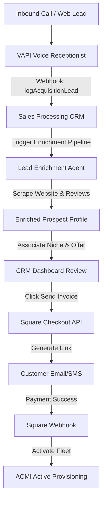

# CRM & Square Billing Integration Plan

This plan describes how the **Sales Processing Agent CRM** integrates lead enrichment, product offers, and Square payment processing for the **AZ Pet Stylist** managed agent fleet.

---

## 🚀 1. Complete Architecture Flow



---

## 📊 2. Database & Lead Enrichment Alignment

We have seeded the CRM database with the following records to support **AZ Pet Stylist** and similar mobile service clients:
1. **Niche:** `mobile-pet-grooming` (defines search keywords, ideal profiles, and checkMoeGoAvailability criteria).
2. **Product:** `ACMI Mobile Grooming Agent Fleet` (defines voice AI configs, SMS rebooking features, and GSD telemetry dashboards).
3. **Offers:** 
   * **Plan A ($497/mo):** Base managed fleet with 1,500 monthly minutes.
   * **Plan B ($1,997/mo):** Enterprise unlimited fleet with custom Moego schema syncs.
4. **Prospect (Enriched Lead):** `AZ Pet Stylist` is staged in the CRM with detailed brand assets:
   * Tagline: *"Where the grooming comes to you!"*
   * Brand Colors: Primary Red (`#D82624`), Secondary Yellow (`#F9D82F`), Accent Gold (`#FBAE02`), Accent Blue (`#2FA5DF`).
   * Fonts: Poppins (headings), Roboto (body).
   * Booking: MoeGo system mapping.
   * Trust Signals: 298 Google reviews at 5.0 stars & Community Choice Awards (2023-2025).

---

## 💳 3. Square Catalog Line Items Created

We executed a batch upsert to the Square Catalog API for location `LR5NVJMQNQ65Y`. The following catalog objects are active in Square:

| Catalog Object Type | Square ID | SKU | Name / Description | Price (USD) |
| :--- | :--- | :--- | :--- | :--- |
| **CATEGORY** | `GROHRMVPP5VWIBSOCPRVKLBW` | --- | **ACMI Agent Fleets** | --- |
| **ITEM** | `ANQUEKT36MIOTMDSPE6XEUCW` | `acmi-grooming-setup` | **Setup Fee** (One-time custom voice prompt & Moego API setup) | **$2,500.00** |
| **ITEM** | `C4QUOFNUOTUMDWADGVLGBAZX` | `acmi-grooming-plan-a` | **Plan A Monthly** (Managed Grooming Fleet - 1,500 mins) | **$497.00 / mo** |
| **ITEM** | `JM4CLZSQ5XTVXPSRSMIKYTLU` | `acmi-grooming-plan-b` | **Plan B Monthly** (Full Enterprise Fleet - Unlimited) | **$1,997.00 / mo** |

---

## 🛠️ 4. Execution Plan: CRM Checkout Integration

To fully automate billing inside the Next.js CRM dashboard, we will implement the following endpoint and UI action:

### Step 4.1: API Endpoint `POST /api/billing/create-checkout`
An API route in the CRM backend that initiates a Square Online Checkout link for a given prospect and offer:

```typescript
// app/api/billing/create-checkout/route.ts
import { NextResponse } from 'next/server';
import { prisma } from '@/lib/db';

export async function POST(req: Request) {
  const { prospectId, offerId, planType } = await req.json();

  // 1. Resolve prospect and billing info
  const prospect = await prisma.prospect.findUnique({ where: { id: prospectId } });
  
  // Map correct Square catalog variation IDs
  const setupFeeId = 'ANQUEKT36MIOTMDSPE6XEUCW';
  const recurringPlanId = planType === 'B' 
    ? 'JM4CLZSQ5XTVXPSRSMIKYTLU' 
    : 'C4QUOFNUOTUMDWADGVLGBAZX';

  // 2. Call Square Checkout API
  const response = await fetch('https://connect.squareup.com/v2/online-checkout/payment-links', {
    method: 'POST',
    headers: {
      'Authorization': `Bearer ${process.env.SQUARE_ACCESS_TOKEN}`,
      'Content-Type': 'application/json',
    },
    body: JSON.stringify({
      idempotency_key: `checkout-${prospectId}-${Date.now()}`,
      order: {
        location_id: process.env.SQUARE_LOCATION_ID,
        line_items: [
          { quantity: '1', catalog_object_id: setupFeeId },     // One-time setup
          { quantity: '1', catalog_object_id: recurringPlanId }  // Recurring monthly
        ]
      },
      checkout_options: {
        redirect_url: `${process.env.NEXT_PUBLIC_APP_URL}/dashboard/billing/success?prospectId=${prospectId}`,
        ask_for_shipping_address: false,
        merchant_support_email: 'billing@madezmedia.com'
      },
      pre_populated_data: {
        buyer_email: prospect.email,
        buyer_phone_number: prospect.phone
      }
    })
  });

  const checkoutLink = await response.json();
  
  // 3. Update CRM status to presented
  await prisma.prospectOffer.update({
    where: { prospectId_offerId: { prospectId, offerId } },
    data: { status: 'presented', notes: `Invoice link generated: ${checkoutLink.payment_link.url}` }
  });

  return NextResponse.json({ url: checkoutLink.payment_link.url });
}
```

### Step 4.2: Webhook Handler `POST /api/billing/square-webhook`
Handles Square's payment success events to convert the lead in the CRM and trigger agent provisioning:
* Event type to listen for: `order.updated` or `payment.created`.
* **Action:**
  1. Set prospect status to `converted`.
  2. Set `ProspectOffer` status to `accepted`.
  3. Create an entry in `Interaction` logging payment approval.
  4. Trigger a workflow payload to the ACMI Super Bus to spawn the active client fleet.
