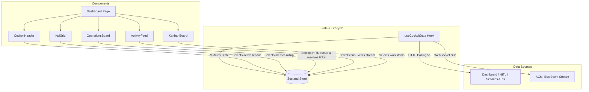

# Spec: GSD Dashboard Reorganization and Kami Visual Refinement

- **Date**: 2026-07-13
- **Status**: DRAFT (Awaiting operator approval)
- **Author**: Antigravity Frontend specialist
- **Location**: `docs/superpowers/specs/2026-07-13-gsd-dashboard-reorganization-design.md`

---

## 1. Executive Summary
This design specification defines the architectural reorganization and visual transformation of the Fleet Command Cockpit dashboard. 
The current dashboard in `src/app/page.tsx` is an 807-line monolithic file carrying UI structure, theme styling, WebSocket subscriptions, HTTP polling, and interactive state.

### Core Objectives:
1. **Architectural Separation**: Decompose `page.tsx` into modular child components and extract all fetching/streaming logic into a custom hook.
2. **State Centralization**: Integrate a global Zustand store to hold active data slices, optimizing components to re-render only when their selected data changes.
3. **Kami Visual System**: Transition the aesthetic from generic box/card Tailwind layouts to a minimalist, high-density, paper-first editorial layout.
4. **Resource Efficiency**: Make data polling focus-aware (timer suspends when the browser tab is hidden/inactive) and secure clean stream unmounts.

---

## 2. System Architecture & Data Flow



### 2.1 The Zustand Store (`src/store/useCockpitStore.ts`)
A global store declared via Zustand. It carries all cockpit states and simple, atomic state mutation functions.

```typescript
import { create } from "zustand";

export interface CockpitState {
  // State
  rollup: ACMIDashboardRollup | null;
  hitlQueue: HitlTicket[];
  services: ServiceRegistry[];
  busEvents: BusEvent[];
  activeTenant: "all" | "madez" | "duane" | "suzanne" | "avery";
  syncStatus: "idle" | "syncing" | "stalled";
  forcingSync: boolean;
  actioningMember: string | null;
  feedbackNote: string;
  copiedId: string | null;

  // Setters/Actions
  setRollup: (rollup: ACMIDashboardRollup | null) => void;
  setHitlQueue: (queue: HitlTicket[]) => void;
  setServices: (services: ServiceRegistry[]) => void;
  appendBusEvent: (event: BusEvent) => void;
  setActiveTenant: (tenant: "all" | "madez" | "duane" | "suzanne" | "avery") => void;
  setSyncStatus: (status: "idle" | "syncing" | "stalled") => void;
  setForcingSync: (forcing: boolean) => void;
  setActioningMember: (member: string | null) => void;
  setFeedbackNote: (note: string) => void;
  setCopiedId: (id: string | null) => void;
}
```

### 2.2 The Custom Hook (`src/hooks/useCockpitData.ts`)
Encapsulates all fetching loops and stream connections:
- Instantiates a `setInterval` loop that polls `fetchDashboardRollup`, `fetchHitlQueue`, and `fetchServices` every 5 seconds.
- Uses `document.visibilityState` to pause polling when the browser tab goes into the background, and resumes immediately when the tab is focused.
- Subscribes to `busStream` on mount and dispatches `appendBusEvent` to the store.
- Cleans up subscriptions and timers cleanly on unmount.

---

## 3. Component Decomposition

The current main file will be divided into the following isolated sub-components under `src/components/dashboard/`:

1. **`CockpitHeader.tsx`**:
   * Header container, page title, Quick Docs toggler, and the visual active tenant selector buttons.
   * Pulls `activeTenant` and `syncStatus` from store. Calls `setActiveTenant` and `handleForceSync`.
2. **`KpiGrid.tsx`**:
   * Renders the 5 core metric cards (Swarms, Active Agents, Microservices, Work Registry, Urgent Tasks).
   * Pulls metrics rollup and active services from the store.
3. **`OperationsBoard.tsx`**:
   * Displays the urgent operator alerts (active HITL queue items and stalled tasks).
   * Renders the resolution action sheet form (instruction inputs, Approve/Reject triggers).
4. **`ActivityFeed.tsx`**:
   * Renders the console activity log stream combining bus events and historical log rollups.
   * Displays the curl quick-diagnostic command card.
5. **`KanbanBoard.tsx`**:
   * Renders the horizontal pipeline tracker across the four lifecycle columns (Backlog, Active, Stalled, Completed).
   * Renders individual task preview cards inside scrollable list views.

---

## 4. Visual Styles & Styling System (Kami Aesthetic)

To implement the **Kami (Minimalist Paper)** design identity, styling overrides will be applied via Tailwind configuration and inline style guidelines:

* **Theme Backdrop**: Page background set to `#fbfaf5` (`bg-[#fbfaf5]`). No pure whites or cool grays are permitted for major backdrops.
* **Typography**:
  * Main headings (e.g., dashboard name, card headers) set to high-quality Serif: `font-serif font-bold text-[#0d1b2a]`.
  * Secondary headings, metadata, and console stream items set to low-contrast sans-serif/monospace: `font-mono text-[#2c3e50] uppercase`.
  * Body copy and task descriptions set to clean sans-serif with a relaxed line height: `font-sans leading-[1.625] text-[#0d1b2a]`.
* **Geometry**:
  * Drop shadows are disabled: cards must use `shadow-none` instead of standard card drop-shadows.
  * Border rules: cards and dividers use fine parchment lines: `border border-[#e5e3d7] bg-[#f5f4ed]/50`.
  * Sharp corners: Card corner radii are capped at `rounded-[4px]`.
* **Accents**:
  * Dry-vermillion red (`#c0392b`) for stalled tasks or HITL tickets.
  * Forest green (`#27ae60`) for active/connected indicators.

---

## 5. Verification Plan

1. **Static Lint Audits**:
   * Run `npm run lint` to verify that imports, prop interfaces, and type safety constraints are fully compliant.
2. **Compilation Tests**:
   * Run `npm run build` to compile the restructured workspace and ensure all Next.js dev server dependencies and manifest generation routes are complete.
3. **Visual Audit**:
   * Check layout rendering, typography margins, and contrast metrics in the browser.
